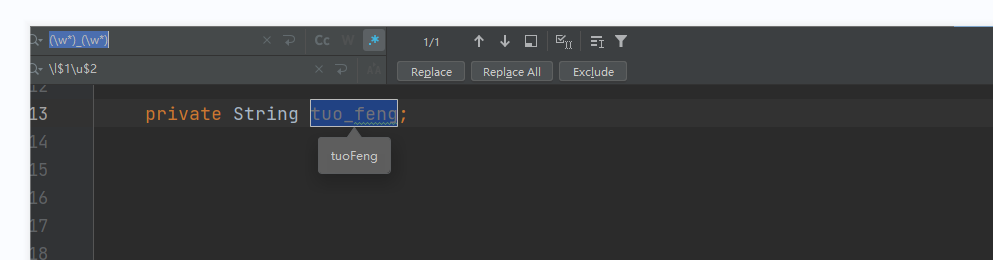

# 下划线转驼峰

## idea
1. 查找替换,并打卡通配符模式

2. 包含一个下划线的
(\w)_(\w)
\l$1\u$2

3. 包含两个下划线的
(\w)(\w)(\w*)
\l$1\u$2\u$3

## vim

" Convert each name_like_this to NameLikeThis in current line.
:s#\(\%(\<\l\+\)\%(_\)\@=\)\|_\(\l\)#\u\1\2#g

" Convert each name_like_this to nameLikeThis in current line.
:s#_\(\l\)#\u\1#g

" Convert each NAME_LIKE_THIS to NameLikeThis in the current line.
:s#_*\(\u\)\(\u*\)#\1\L\2#g